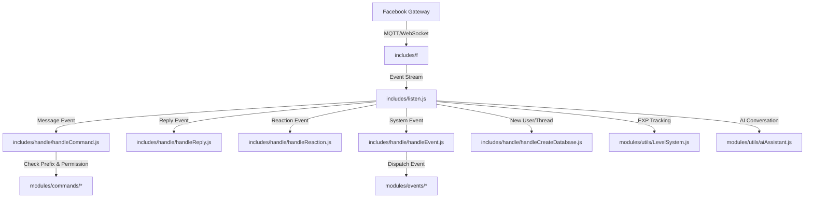
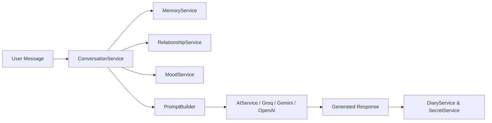

# 📖 Tài Liệu Kỹ Thuật Hệ Thống Messenger Bot (DarkWin Architecture)

Tài liệu này cung cấp chi tiết kỹ thuật chuyên sâu về kiến trúc luồng sự kiện, cơ sở dữ liệu SQLite3, hệ thống AI Social Engine (`src/`), hệ thống tính cấp độ (Level/EXP), cơ chế Hot-Reloading, phân quyền và hướng dẫn phát triển module cho dự án **Messenger Bot**.

---

## 📑 Mục Lục

1. [Kiến Trúc Tổng Thể & Luồng Xử Lý Sự Kiện](#1-kiến-trúc-tổng-thể--luồng-xử-lý-sự-kiện)
2. [Cấu Trúc Thư Mục & Phân Hệ](#2-cấu-trúc-thư-mục--phân-hệ)
3. [Cơ Sở Dữ Liệu SQLite & Quản Trị Dữ Liệu (/runtime)](#3-cơ-sở-dữ-liệu-sqlite--quản-trị-dữ-liệu-runtime)
4. [Hệ Thống AI Social Engine (src/)](#4-hệ-thống-ai-social-engine-src)
5. [Hệ Thống Tính Cấp Độ & Danh Hiệu (LevelSystem)](#5-hệ-thống-tính-cấp-độ--danh-hiệu-levelsystem)
6. [Hệ Thống Phân Quyền & Quản Lý Nhóm](#6-hệ-thống-phân-quyền--quản-lý-nhóm)
7. [Lập Lịch Tự Động (Autosend & Mode Scheduler)](#7-lập-lịch-tự-động-autosend--mode-scheduler)
8. [Tự Động Hóa Trích Xuất Cookie (export-appstate.js)](#8-tự-động-hóa-trích-xuất-cookie-export-appstatejs)
9. [Hướng Dẫn Phát Triển Command & Event Mới](#9-hướng-dẫn-phát-triển-command--event-mới)

---

## 1. Kiến Trúc Tổng Thể & Luồng Xử Lý Sự Kiện

Hệ thống hoạt động theo mô hình **Event-Driven Architecture** bất đồng bộ dựa trên nền tảng WebSocket/MQTT của Facebook Chat API (`includes/f`):



### Các thành phần cốt lõi:
1. **`index.js`**: Điểm khởi tạo toàn cục. Nạp cấu hình (`config.json`, `.env`), kết nối SQLite3, nạp toàn bộ Commands/Events vào `global.client.commands`, `global.client.events` và bắt đầu phiên đăng nhập `api.listenMqtt()`.
2. **`includes/listen.js`**: Bộ lắng nghe trung tâm nhận diện kiểu sự kiện (`message`, `message_reply`, `message_reaction`, `event`, `change_thread_image`, v.v.) và phân phối đến các Handler.
3. **`includes/handle/`**:
   - `handleCommand.js`: Phân tích prefix (mặc định hoặc custom prefix của nhóm), kiểm tra quyền (`checkPermission`), lọc cooldown và gọi `command.execute()`.
   - `handleReply.js`: Điều hướng các phản hồi theo chuỗi tin nhắn bot (ví dụ: menu phân trang, nhập dữ liệu bước kế tiếp).
   - `handleReaction.js`: Bắt sự kiện thả cảm xúc của người dùng để xác nhận thao tác.
   - `handleCreateDatabase.js`: Tự động khởi tạo hồ sơ người dùng / nhóm mới trong CSDL khi có tương tác.
   - `handleEvent.js`: Xử lý các sự kiện hệ thống nhóm (bot vào nhóm, đổi biệt danh, chống tag all, kick, join/leave).

---

## 2. Cấu Trúc Thư Mục & Phân Hệ

```text
├── index.js                     # File khởi tạo chính của bot
├── config.json                  # Cấu hình bot (prefix, adminIDs, AI, fca...)
├── FastConfigFca.json           # Cấu hình tối ưu kết nối FCA
├── .env.example                 # File mẫu biến môi trường
│
├── runtime/                     # THƯ MỤC LƯU DỮ LIỆU RUNTIME (Được .gitignore bảo vệ)
│   ├── bot.db                   # File CSDL SQLite3 chính
│   ├── appstate.json            # Trạng thái phiên đăng nhập Facebook
│   ├── social_engine.sqlite     # CSDL dành cho AI Social Engine
│   └── appstates/               # Thư mục appstate của các profile con
│
├── includes/                    # Thư viện lõi và bộ xử lý sự kiện
│   ├── f/                       # Thư viện FCA (Facebook Chat API) - READ ONLY
│   ├── listen.js                # Event Listener chính
│   ├── controllers/             # Controller quản lý Users, Threads, Currencies
│   ├── database/                # Khởi tạo mô hình dữ liệu
│   └── handle/                  # Các handler (Command, Event, Reply, Reaction...)
│
├── modules/                     # CÁC MODULE LỆNH VÀ SỰ KIỆN
│   ├── commands/                # Lệnh người dùng (tổ chức theo 6 nhóm chuyên biệt)
│   │   ├── adminbot/            # Lệnh quản trị tối cao (cluster, cmd, duyetbox, mode, setthue...)
│   │   ├── economy/             # Lệnh kinh tế (tien, bank, lamviec, shop, quest, vay...)
│   │   ├── group/               # Lệnh tương tác nhóm (checktt, toplv, autorep, kiss, dam...)
│   │   ├── minigame/            # Minigame giải trí (taixiu, baucua, noitu, bongda, sicbo...)
│   │   ├── qtv/                 # Lệnh Quản trị viên (add, kick, anti, canhbao, cutvv, setprefix...)
│   │   └── tools/               # Lệnh công cụ (ai, music, vidgai, say, autosend, taoanh...)
│   ├── events/                  # Sự kiện tự động (aiAutoReply, anti, autotiktok, join, leave...)
│   └── utils/                   # Bộ công cụ chung (database, LevelSystem, checkPermission, logger...)
│
├── src/                         # HỆ THỐNG AI SOCIAL ENGINE (Multi-Character World)
│   ├── ai/                      # Tích hợp ComfyUI
│   ├── app.js                   # Entrypoint của Social Engine
│   ├── database/                # SQLite Driver & schema.sql
│   ├── jobs/                    # Background Jobs (hồi phục cảm xúc, ghi nhật ký)
│   ├── managers/                # Quản lý Cluster & Account Profiles
│   ├── providers/               # AI Providers (Groq, Gemini, OpenAI, Ollama)
│   ├── repositories/            # Repository pattern cho User, Memory, Mood, Diary, Secret
│   └── services/                # Business logic (CharacterService, ConversationService...)
│
├── cache/                       # Thư mục cache runtime (media tạm thời, avatar box)
├── logs/                        # File nhật ký hoạt động (bot.log)
├── windows/                     # Script cài đặt tự khởi động trên Windows
└── scripts/                     # Kịch bản bảo trì, di chuyển dữ liệu (migration)
```

---

## 3. Cơ Sở Dữ Liệu SQLite & Quản Trị Dữ Liệu (`/runtime`)

Hệ thống sử dụng **SQLite3** với chế độ **WAL (Write-Ahead Logging)** cho tốc độ I/O cực cao và không lo lock file.

### 3.1. Kết nối qua `modules/utils/database.js`
Cung cấp bộ API async/await tương thích:
- `getConnection()`: Lấy connection wrapper hỗ trợ transaction và auto-release.
- `execute(sql, params)`: Thực thi câu lệnh SQL trực tiếp với Promise.
- `ensureUserAccount(threadID, userID, name)`: Tự động khởi tạo dữ liệu ví và tài khoản nếu chưa tồn tại.

### 3.2. Cấu trúc bảng chính trong `runtime/bot.db`
- **`messenger_users`**: Quản lý số dư ví (`credits`), số dư ngân hàng (`bank_balance`), thể lực (`energy`), điểm danh (`last_checkin`), tù nhân (`jail_until`), cấp độ và kinh nghiệm.
- **`messenger_threads`**: Quản lý thông tin nhóm chat, trạng thái duyệt (`is_approved`), chế độ hoạt động (`mode`), tiền tố lệnh tùy chỉnh (`custom_prefix`).
- **`bot_rentals`**: Quản lý thời hạn thuê bot của các nhóm, ngày kích hoạt và ngày hết hạn.
- **`user_warnings`**: Lưu trữ số lần cảnh báo vi phạm của thành viên theo từng nhóm chat.
- **`user_level_exp`**: Lưu trữ kinh nghiệm (EXP) và Level của từng thành viên trong từng nhóm hoặc toàn cầu.

---

## 4. Hệ Thống AI Social Engine (`src/`)

Hệ thống **AI Social Engine** là kiến trúc mô phỏng một xã hội nhân vật AI sống động với ký ức dài hạn, cảm xúc biến đổi theo thời gian và quan hệ xã hội:



- **`CharacterService`**: Quản lý danh sách nhân vật AI, tính cách (personality) và phong cách nói chuyện (system prompt).
- **`MemoryService`**: Tự động trích xuất sự kiện quan trọng vào bộ nhớ dài hạn, tóm tắt ngữ cảnh cuộc trò chuyện.
- **`MoodService`**: Cảm xúc biến đổi (`vui`, `buồn`, `giận`, `hào hứng`) dựa trên nội dung người dùng tương tác.
- **`SharedKnowledgeService`**: Cho phép các nhân vật AI chia sẻ một lượng kiến thức chung về người dùng để không mất ngữ cảnh khi đổi nhân vật.
- **`BackgroundJobs`**: Chạy ngầm định kỳ để cập nhật trạng thái tâm lý nhân vật và tạo trang nhật ký tự động.

---

## 5. Hệ Thống Tính Cấp Độ & Danh Hiệu (`LevelSystem`)

Module [modules/utils/LevelSystem.js](file:///home/leevawn/bot-loz/bot-mess/modules/utils/LevelSystem.js) tự động hóa việc tính điểm kinh nghiệm cho người dùng qua từng tin nhắn:

- **EXP mỗi tin nhắn**: `10 - 25 EXP` (Áp dụng cooldown 15 giây chống spam).
- **Công thức thăng cấp**:
  $$\text{EXP Cần Thiết} = \lfloor 50 \times \text{Level}^{1.5} \rfloor$$
- **Cơ chế danh hiệu**: Cung cấp danh hiệu tự động từ *Tập Sự* (Cấp 1) đến *Bất Diệt* (Cấp 500+).
- **Bật/Tắt Thông Báo**: Quản trị viên nhóm có thể bật hoặc tắt thông báo thăng cấp bằng lệnh `!rankup on/off` (lưu tại `modules/utils/levelSettings.js`).

---

## 6. Hệ Thống Phân Quyền & Quản Lý Nhóm

Kiểm tra phân quyền tập trung tại [modules/utils/checkPermission.js](file:///home/leevawn/bot-loz/bot-mess/modules/utils/checkPermission.js):

| Quyền | Giá Trị | Đối Tượng Áp Dụng | Mô Tả |
| :--- | :---: | :--- | :--- |
| `user` | `0` | Tất cả thành viên | Dùng được các lệnh kinh tế, minigame, tiện ích, tương tác |
| `admingr` | `1` | Quản trị viên nhóm (QTV) | Dùng các lệnh quản trị nhóm, chống phá, cảnh báo, kick, đổi prefix |
| `adminbot` | `2` | UID trong `ADMIN_IDS` | Toàn quyền kiểm soát hệ thống, duyệt nhóm, cấp hạn thuê, reload code |

---

## 7. Lập Lịch Tự Động (Autosend & Mode Scheduler)

1. **Autosend Scheduler (`modules/utils/autosendScheduler.js`)**:
   - Quét định kỳ mỗi 30 giây để kiểm tra các mốc giờ gửi tin nhắn tự động được cấu hình theo nhóm.
   - Hỗ trợ **Hot-Reloading**: Khi dùng lệnh `!cmd reload autosendScheduler`, tiến trình `setInterval` cũ trong RAM sẽ tự động được hủy và làm mới mà không cần khởi động lại bot.
2. **Mode Scheduler (`modules/utils/modeScheduler.js`)**:
   - Tự động chuyển đổi `mode` hoạt động của nhóm theo khung giờ cài đặt trước trong `mode_schedule.json` (ví dụ: tự động tắt lệnh giải trí sau 23:00).

---

## 8. Tự Động Hóa Trích Xuất Cookie (`export-appstate.js`)

Khi cookie đăng nhập Facebook hết hạn, hệ thống hỗ trợ tự động mở trình duyệt và làm mới `appstate.json`:
- **AdsPower Anti-Detect Browser**: Kết nối qua REST API `http://127.0.0.1:50325` bằng Playwright để lấy cookie mới nhất.
- **Brave / Google Chrome**: Tự động kết nối qua Remote Debugging Port (`--remote-debugging-port=9222`) hoặc đọc trực tiếp tệp SQLite Cookie của profile trình duyệt trên máy chủ Linux/Windows.

---

## 9. Hướng Dẫn Phát Triển Command & Event Mới

### 9.1. Cấu trúc chuẩn của một Command (`modules/commands/...`)

```javascript
module.exports = {
  name: "example",                 // Tên lệnh chính (viết thường)
  category: "tools",               // Phân nhóm lệnh (adminbot, economy, group, minigame, qtv, tools)
  description: "Mô tả ngắn gọn về chức năng của lệnh",
  usage: "\n!example [tham số] → Hướng dẫn sử dụng chi tiết",
  permission: 0,                   // 0: User, 1: QTV, 2: Admin Bot

  execute: async ({ api, event, args, config }) => {
    const { threadID, messageID, senderID } = event;
    const prefix = config?.prefix || "!";

    // Logic xử lý lệnh tại đây
    return api.sendMessage(`Chào bạn! Lệnh example đã chạy thành công.`, threadID, messageID);
  },

  // (Tùy chọn) Xử lý khi người dùng phản hồi tin nhắn của bot
  handleReply: async ({ api, event, handleReply }) => {
    // Xử lý dữ liệu phản hồi
  },

  // (Tùy chọn) Xử lý khi người dùng thả reaction vào tin nhắn của bot
  handleReaction: async ({ api, event, handleReaction }) => {
    // Xử lý dữ liệu reaction
  }
};
```

### 9.2. Cấu trúc chuẩn của một Event (`modules/events/...`)

```javascript
module.exports = {
  name: "exampleEvent",
  description: "Mô tả chức năng của sự kiện lắng nghe ngầm",

  execute: async ({ api, event, config }) => {
    // Lắng nghe và xử lý sự kiện (ví dụ: log:subscribe, message, v.v.)
    if (event.logMessageType === "log:subscribe") {
      // Xử lý thành viên mới tham gia nhóm
    }
  }
};
```

Sau khi tạo xong file, bạn có thể áp dụng ngay lập tức trong khi bot đang chạy bằng lệnh:
```text
!cmd load <đường_dẫn_file>
```
*(Ví dụ: `!cmd load modules/commands/tools/example.js`)*

---

*Tài liệu kỹ thuật được cập nhật chính thức cho phiên bản DarkWin Messenger Bot Engine.*
