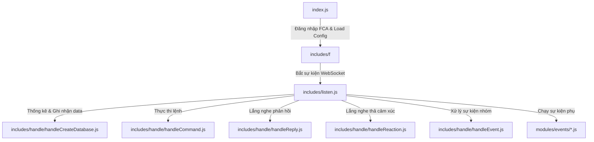

# 📖 Tài Liệu Hướng Dẫn Hệ Thống Messenger Bot

Tài liệu này cung cấp cái nhìn toàn diện về kiến trúc, cấu hình, cơ sở dữ liệu, phân quyền, tích hợp AI và hướng dẫn phát triển module cho dự án **Messenger Bot**.

---

## 📑 Mục Lục

1. [Tổng Quan Dự Án & Yêu Cầu Môi Trường](#1-tổng-quan-dự-án--yêu-cầu-môi-trường)
2. [Kiến Trúc & Cấu Trúc Thư Mục](#2-kiến-trúc--cấu-trúc-thư-mục)
3. [Cấu Hình Hệ Thống](#3-cấu-hình-hệ-thống)
4. [Cơ Sở Dữ Liệu SQLite & Quản Lý Dữ Liệu](#4-cơ-sở-dữ-liệu-sqlite--quản-lý-dữ-liệu)
5. [Hệ Thống Phân Quyền & Mode Scheduler](#5-hệ-thống-phân-quyền--mode-scheduler)
6. [Tích Hợp AI Ollama & Auto Reply](#6-tích-hợp-ai-ollama--auto-reply)
7. [Tối Ưu Hóa Hiệu Năng & Bảo Mật](#7-tối-ưu-hóa-hiệu-năng--bảo-mật)
8. [Hướng Dẫn Phát Triển Module Mới](#8-hướng-dẫn-phát-triển-module-mới)

---

## 1. Tổng Quan Dự Án & Yêu Cầu Môi Trường

### 1.1. Giới thiệu
**Messenger Bot** là một nền tảng bot tự động dành cho Facebook Messenger được xây dựng trên nền **Node.js** và thư viện **FCA (Facebook Chat API)** tùy chỉnh (`includes/f`). Nền tảng hỗ trợ:
- Tổ chức lệnh dạng modular linh hoạt (kinh tế, minigame, quản lý nhóm, công cụ, AI, hệ thống).
- Cơ chế cơ sở dữ liệu **SQLite** lưu giữ tập trung ở thư mục `/runtime`.
- Tự động hóa lấy cookie/appstate từ trình duyệt khi cookie hết hạn.
- Tích hợp mô hình AI ngôn ngữ lớn (LLM) chạy local qua **Ollama**.
- Hệ thống phân quyền nhiều cấp và lịch trình chuyển đổi chế độ hoạt động tự động.

### 1.2. Yêu cầu môi trường
- **Node.js**: Phiên bản 18+ (khuyến nghị 20+ LTS).
- **SQLite3**: Hệ quản trị CSDL nhẹ, lưu file dữ liệu SQLite tại `/runtime/bot.db`.
- **Ollama** *(tuỳ chọn)*: Dùng cho tính năng hỏi đáp AI và tự động trả lời (`!ai`, `aiAutoReply`).

---

## 2. Kiến Trúc & Cấu Trúc Thư Mục

### 2.1. Luồng xử lý sự kiện (Event Lifecycle)



1. **`index.js`**: Điểm khởi đầu (Entrypoint). Nạp cấu hình, kết nối CSDL SQLite, kiểm tra `appstate.json`, khởi tạo danh sách lệnh/sự kiện toàn cục (`global.client.commands`, `global.client.events`), và bắt đầu đăng nhập Facebook qua `includes/f`.
2. **`includes/listen.js`**: Bộ lắng nghe trung tâm nhận mọi sự kiện từ Facebook (tin nhắn, reaction, unsend, join/leave, v.v.) và phân phối đến các bộ xử lý `handle`.
3. **`includes/handle/`**:
   - `handleCommand.js`: Kiểm tra prefix, phân quyền (user/admingr/adminbot), bóc tách tham số và gọi lệnh tương ứng trong `modules/commands`.
   - `handleReply.js`: Quản lý các phản hồi nối tiếp tin nhắn (ví dụ: trả lời tin nhắn của bot để chọn menu).
   - `handleReaction.js`: Quản lý sự kiện khi người dùng thả icon cảm xúc vào tin nhắn của bot.
   - `handleCreateDatabase.js`: Tự động khởi tạo bản ghi cho nhóm/người dùng mới khi xuất hiện tương tác.
   - `handleEvent.js`: Phân phối các sự kiện hệ thống (bot gia nhập nhóm, thành viên rời nhóm, v.v.) tới các file trong `modules/events`.

### 2.2. Cấu trúc thư mục dự án

```text
├── index.js                     # File khởi tạo chính của bot
├── config.json                  # Cấu hình bot chính (prefix, adminIDs, AI, fca...)
├── FastConfigFca.json           # Cấu hình nâng cao cho thư viện FCA
├── .env                         # Biến môi trường (DB, AI, Logger, Chrome IP, v.v.)
├── package.json                 # Danh sách thư viện dependency
│
├── runtime/                     # THƯ MỤC NƠI LƯU DỮ LIỆU RUNTIME
│   ├── bot.db                   # File cơ sở dữ liệu SQLite chính
│   └── appstate.json            # Trạng thái đăng nhập Facebook
│
├── includes/                    # Thư viện lõi và bộ xử lý sự kiện
│   ├── f/                       # Thư viện FCA (Facebook Chat API)
│   ├── listen.js                # Event Listener chính
│   ├── controllers/             # Controller quản lý Users, Threads, Currencies
│   ├── database/                # Khởi tạo ORM / kết nối DB
│   └── handle/                  # Các handler (Command, Event, Reply, Reaction...)
│
├── modules/                     # CÁC MODULE LỆNH VÀ SỰ KIỆN
│   ├── commands/                # Lệnh người dùng (tổ chức theo nhóm)
│   │   ├── adminbot/            # Lệnh dành cho Admin Bot
│   │   ├── economy/             # Lệnh kinh tế (tiền, ngân hàng, làm việc...)
│   │   ├── group/               # Lệnh quản lý nhóm chat
│   │   ├── minigame/            # Minigame (tài xỉu, bầu cua, câu cá...)
│   │   ├── qtv/                 # Lệnh Quản trị viên nhóm
│   │   ├── system/              # Lệnh hệ thống (ping, help, mode...)
│   │   └── tools/               # Lệnh tiện ích (dịch, tts, ai...)
│   ├── events/                  # Sự kiện tự động (anti, aiAutoReply, join, leave...)
│   └── utils/                   # Các tiện ích chung (database, logger, cache...)
│
├── cache/                       # Cache tạm thời (ảnh, âm thanh, lịch sử checktt...)
├── logs/                        # File nhật ký hoạt động (bot.log)
└── scripts/                     # Các kịch bản phụ trợ và migration
```

---

## 3. Cấu Hình Hệ Thống

### 3.1. File `config.json`
Chứa các thiết lập cơ bản của bot:

```json
{
  "botName": "Bot láo loz",
  "prefix": "/",
  "adminIDs": [
    "100037351338722"
  ],
  "adminOnly": false,
  "language": "vi",
  "fca": {
    "forceLogin": true,
    "selfListen": true,
    "autoMarkDelivery": false,
    "userAgent": "Mozilla/5.0 (Windows NT 10.0; Win64; x64)..."
  },
  "ai": {
    "enabled": true,
    "autoReplyOnlyGroups": false,
    "ollamaHost": "http://127.0.0.1:11434",
    "model": "qwen2.5:3b"
  }
}
```

### 3.2. File `.env` (Biến Môi Trường)
Quản lý các cấu hình nhạy cảm và tham số hệ thống:

```ini
# Cấu hình Cơ sở dữ liệu SQLite
SQLITE_DB_PATH=/home/leevawn/bot-loz/bot-mess/runtime/bot.db

# Cấu hình Bot
BOT_PREFIX=/
BOT_NAME=Bot láo loz
ADMIN_IDS=100037351338722,61578017290778

# Cấu hình AI Ollama Local
AI_ENABLED=true
AI_AUTO_REPLY_ENABLED=true
AI_OLLAMA_HOST=http://127.0.0.1:11434
AI_OLLAMA_MODEL=qwen2.5:3b
AI_REPLY_LIMIT=10
AI_COOLDOWN_MS=60000

# Bảo mật & Rate Limiting
RATE_LIMIT_ENABLED=true
RATE_LIMIT_WINDOW_MS=60000
RATE_LIMIT_MAX_REQUESTS=100

# Nhật ký Logging
LOG_LEVEL=info
LOG_FILE_PATH=logs/bot.log

# Múi giờ
TZ=Asia/Ho_Chi_Minh
```

---

## 4. Cơ Sở Dữ Liệu SQLite & Quản Lý Dữ Liệu

### 4.1. Kiến trúc kết nối SQLite (`modules/utils/database.js`)
Hệ thống sử dụng **SQLite3** với các thiết lập tối ưu:
- **WAL Mode** (`PRAGMA journal_mode=WAL;`): Tăng tốc độ đọc/ghi đồng thời mà không bị khóa file.
- **Tương thích async/await API**: Cung cấp giao diện hàm `getConnection()`, `execute()`, `executeTransaction()`, `ensureUserAccount()` theo phong cách Promise giúp tương thích hoàn toàn với mã lệnh cũ.
- File cơ sở dữ liệu được lưu trữ cố định tại: **`/runtime/bot.db`**.

### 4.2. Bảng dữ liệu chính trong SQLite (`messenger_users`)

| Tên Cột | Kiểu Dữ Liệu | Mô Tả |
| :--- | :--- | :--- |
| `thread_id` | `VARCHAR` | ID của nhóm chat (hoặc `global`) |
| `psid` | `VARCHAR` | ID người dùng (UID Facebook) |
| `name` | `TEXT` | Tên hiển thị người dùng |
| `credits` | `BIGINT` | Số tiền/xu trong ví của người dùng |
| `bank_balance`| `BIGINT` | Số tiền gửi ngân hàng |
| `last_checkin`| `DATETIME` | Lần điểm danh gần nhất |

### 4.3. Script di chuyển dữ liệu (Migration)
Dự án có sẵn script di chuyển toàn bộ dữ liệu từ MySQL sang SQLite:
```bash
node scripts/migrate-mysql-to-sqlite.js
```
Script sẽ tự động sao lưu CSDL `bot.db` hiện tại và chép toàn bộ các bảng dữ liệu từ MySQL sang SQLite.

---

## 5. Hệ Thống Phân Quyền & Mode Scheduler

### 5.1. Cấp độ phân quyền (Permission Levels)

1. **`user` (0)**: Mọi thành viên trong nhóm chat có thể sử dụng các lệnh thông thường.
2. **`admingr` (1)**: Chỉ Quản trị viên của nhóm chat mới có quyền sử dụng (các lệnh cài đặt nhóm, anti, kick, setname...).
3. **`adminbot` (2)**: Chỉ các UID nằm trong danh sách `adminIDs` (cấu hình tại `config.json` hoặc `.env`) mới có quyền thực thi (các lệnh hệ thống, thuebot, reload, ban...).

Kiểm tra phân quyền được xử lý tập trung tại module `modules/utils/checkPermission.js`.

### 5.2. Chế độ nhóm & Lịch trình tự động (`modeScheduler`)
Bot hỗ trợ chuyển đổi chế độ hoạt động nhóm (chỉ cho phép Admin dùng bot hoặc cho phép tất cả thành viên).

- File cấu hình lịch trình: `mode_schedule.json`.
- Module điều khiển: `modules/utils/modeScheduler.js`.
- Bắt đầu chạy scheduler tự động khi bot khởi động từ `index.js` thông qua `startModeScheduler()`.

---

## 6. Tích Hợp AI Ollama & Auto Reply

### 6.1. Lệnh AI (`!ai`)
Người dùng có thể trò chuyện trực tiếp với LLM local (Ollama) bằng lệnh:
```text
/ai Hãy viết cho tôi một bài thơ ngắn về biển.
/ai -m qwen2.5:3b Giải thích thuật toán Quicksort.
```

### 6.2. Tự động phản hồi tin nhắn (`modules/events/aiAutoReply.js`)
Bot có khả năng tự động trả lời người dùng trong nhóm chat:
- **Lịch sử hội thoại cá nhân**: Mỗi người dùng trong nhóm được lưu giữ ngữ cảnh cuộc trò chuyện riêng (`historyTurns`).
- **Chống spam / Cooldown**: Sau **10 lượt trả lời liên tiếp** cho cùng 1 người dùng, bot sẽ tạm nghỉ **1 phút** trước khi nhận cuộc hội thoại tiếp theo.
- **Tên thật**: Tự động giải mã danh sách thành viên trong nhóm để gọi tên thật của người dùng thay vì biệt danh.

---

## 7. Tối Ưu Hóa Hiệu Năng & Bảo Mật

### 7.1. Rate Limiting (`modules/utils/rateLimiter.js`)
Sử dụng thư viện `rate-limiter-flexible` nhằm chống lại tình trạng spam tin nhắn/lệnh làm nghẽn bot. Người dùng vượt quá giới hạn sẽ bị tạm khóa thao tác trong một khoảng thời gian ngắn.

### 7.2. Cache Manager (`modules/utils/cacheManager.js`)
Hệ thống Cache hỗ trợ lưu tạm thông tin nhóm/thành viên (ThreadInfo, UserInfo) với thời gian sống (TTL) linh hoạt, hạn chế tối đa việc gọi API Facebook quá nhiều lần.

### 7.3. Nhật ký hoạt động (`modules/utils/logger.js`)
Tích hợp logger **Winston** ghi nhật ký hoạt động, lỗi hệ thống và quá trình thực thi lệnh vào thư mục `logs/bot.log`.

---

## 8. Hướng Dẫn Phát Triển Module Mới

### 8.1. Quy trình tạo một Command mới

1. Chọn thư mục tương ứng trong `modules/commands/<nhóm_lệnh>/` (ví dụ: `tools/hello.js`).
2. Định dạng mã nguồn mẫu cho một lệnh:

```javascript
module.exports = {
  config: {
    name: "hello",             // Tên lệnh (viết thường, không dấu)
    version: "1.0.0",
    hasPermssion: 0,           // 0: User, 1: Admin Group, 2: Admin Bot
    credits: "Tên Tác Giả",
    description: "Gửi lời chào mừng",
    commandCategory: "tools",  // Thư mục nhóm lệnh
    usages: "[tên]",
    cooldowns: 5               // Thời gian chờ giữa 2 lần dùng (giây)
  },

  run: async function ({ api, event, args, Users, Threads, Currencies }) {
    const name = args.join(" ") || "bạn";
    return api.sendMessage(`Xin chào ${name}! Chúc bạn một ngày tốt lành.`, event.threadID, event.messageID);
  },

  // (Tùy chọn) Xử lý khi người dùng reply lại tin nhắn của bot
  handleReply: async function ({ api, event, handleReply }) {
    // Code xử lý reply ở đây
  },

  // (Tùy chọn) Xử lý khi người dùng thả icon cảm xúc vào tin nhắn của bot
  handleReaction: async function ({ api, event, handleReaction }) {
    // Code xử lý reaction ở đây
  }
};
```

3. Khởi động lại bot hoặc nạp lại lệnh để áp dụng thay đổi.

### 8.2. Quy trình tạo một Event mới

1. Tạo file JavaScript mới trong thư mục `modules/events/` (ví dụ: `welcomeNewMember.js`).
2. Định dạng mã nguồn mẫu cho sự kiện:

```javascript
module.exports = {
  config: {
    name: "welcomeNewMember",
    version: "1.0.0",
    description: "Chào mừng thành viên mới gia nhập nhóm"
  },

  handleEvent: async function ({ api, event, Threads, Users }) {
    if (event.logMessageType === "log:subscribe") {
      const addedParticipants = event.logMessageData.addedParticipants;
      for (const participant of addedParticipants) {
        const name = participant.fullName;
        api.sendMessage(`Chào mừng ${name} đã đến với nhóm chat! 🎉`, event.threadID);
      }
    }
  }
};
```

---

*Tài liệu được biên soạn và cập nhật tự động cho dự án Messenger Bot.*
